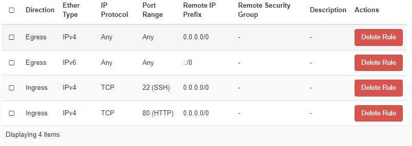

# CSC cloud Ubuntu VM Siba deployment with Docker

Updated: 27.3.2024

This documentation explains how to deploy the Siba project to the CSC cloud cPouta Ubuntu virtual machine using Docker. It is assumed that the user has the VM running and can connect to it with SSH. Some Linux understanding can also be helpful.

- VM OS: Ubuntu 22.04 LTS (64-bit)

Some parts of this documentation are based on this: https://github.com/haagahelia/ohke-teknologiat/blob/master/01_docker/fullstack_dockerized_task/Manual_Installation_commands.md

## Security Groups and firewall

Updates coming to this section when the backend is deployed.

CSC cloud Pouta security groups used:



- Port 22 is for SSH
- Port 80 is for the Nginx frontend deployment.

Pouta Security Groups are used to setup firewall rules in this deployment. Another option to manage firewall is to use ufw inside the Ubuntu VM.

Security Groups can be found by going to Project -> Network -> Security Groups

**NOTE**: Do not open unnecessary ports because it is a security risk! Only open ports that are needed.

More detailed information: https://docs.csc.fi/cloud/pouta/security/

## Update the system

```sh
sudo apt update && sudo apt upgrade -y
```

## Install Docker if not installed

Instructions used: https://docs.docker.com/engine/install/ubuntu/

Remove conflicting Docker packages
```sh
for pkg in docker.io docker-doc docker-compose docker-compose-v2 podman-docker containerd runc; do sudo apt remove $pkg; done
```

Set up Docker's apt repository
```sh
# Add Docker's official GPG key:
sudo apt update
sudo apt install ca-certificates curl
sudo install -m 0755 -d /etc/apt/keyrings
sudo curl -fsSL https://download.docker.com/linux/ubuntu/gpg -o /etc/apt/keyrings/docker.asc
sudo chmod a+r /etc/apt/keyrings/docker.asc

# Add the repository to Apt sources:
echo \
  "deb [arch=$(dpkg --print-architecture) signed-by=/etc/apt/keyrings/docker.asc] https://download.docker.com/linux/ubuntu \
  $(. /etc/os-release && echo "$VERSION_CODENAME") stable" | \
  sudo tee /etc/apt/sources.list.d/docker.list > /dev/null
sudo apt update
```

Install the latest Docker packages:
```sh
sudo apt install docker-ce docker-ce-cli containerd.io docker-buildx-plugin docker-compose-plugin
```

Check the Docker version
```sh
sudo docker version
```

Check the Docker Compose version
```sh
sudo docker compose version
```

Check if the Docker daemon is running
```sh
sudo systemctl status docker
ps -ef | grep docker
```

Enable if not enabled
```sh
sudo systemctl enable docker
```

## Get the source code for the app

Check if git is already installed
```sh
git --version
```

Install it if not installed
```sh
sudo apt update
sudo apt install git
```

This is a very simple way to install git. More detailed info here: https://www.digitalocean.com/community/tutorials/how-to-install-git-on-ubuntu-22-04

Create the directory for the source code and set permissions
```sh
cd ~
sudo chmod 700 .
mkdir siba
```

Clone the frontend and backend git repositories
```sh
cd siba
git clone https://github.com/haagahelia/Siba_be.git
git clone https://github.com/haagahelia/siba-fe.git
```

Pull the latests changes if needed
```sh
cd ~/siba/Siba_be
git pull
cd ~/siba/siba-fe
git pull
```

## Deploy the frontend with Docker

Instructions based on this: https://github.com/haagahelia/siba-fe?tab=readme-ov-file#beginning

Create the frontend .env file for environment variables and set permissions
```sh
cd ~/siba/siba-fe
touch .env
sudo chmod 644 .env
```

Add the following environment variables to the .env file
```sh
VITE_BE_SERVER_BASE_URL=http://<backendaddress>:<backendportnumber>/api
PORT=80
```
Replace `<backendaddress>` with the public IP address of the virtual machine and `<backendportnumber>` with the port of the backend. This is the backend address the frontend will use to make requests. NOTE: Add it after the backend is deployed.

Run the frontend Docker container that uses Nginx web server to serve the React application
```sh
sudo docker compose -f ~/siba/siba-fe/docker-compose-fe-nginx.yaml up -d
```

Check if the container started
```sh
sudo docker ps
```

Now the frontend should be available at `http://<VMIPADDRESS>:80` where `<VMIPADDRESS>` is the public IP address of the virtual machine.

Note that the connection is currently insecure.

To stop and remove the container, run
```sh
sudo docker compose -f ~/siba/siba-fe/docker-compose-fe-nginx.yaml down
```

## Deploy the database and backend with Docker

Coming later
